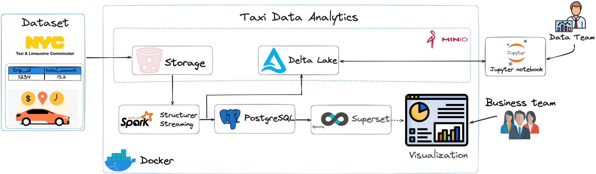
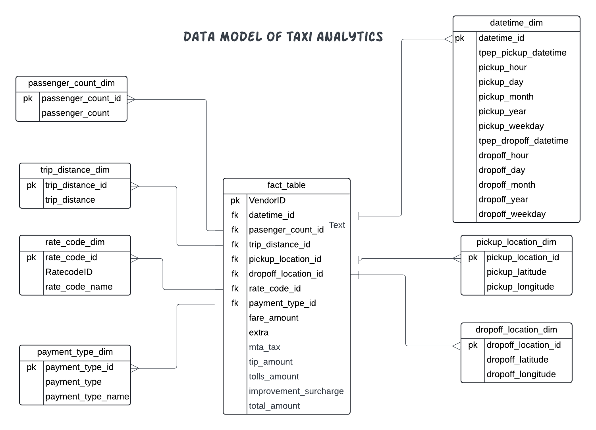
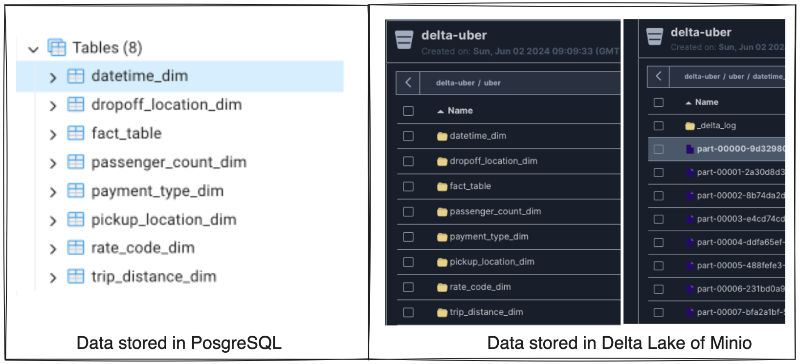
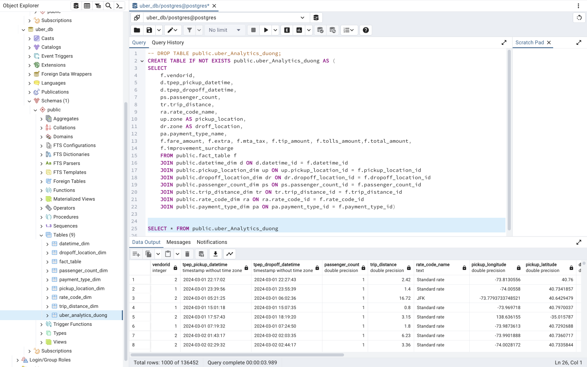
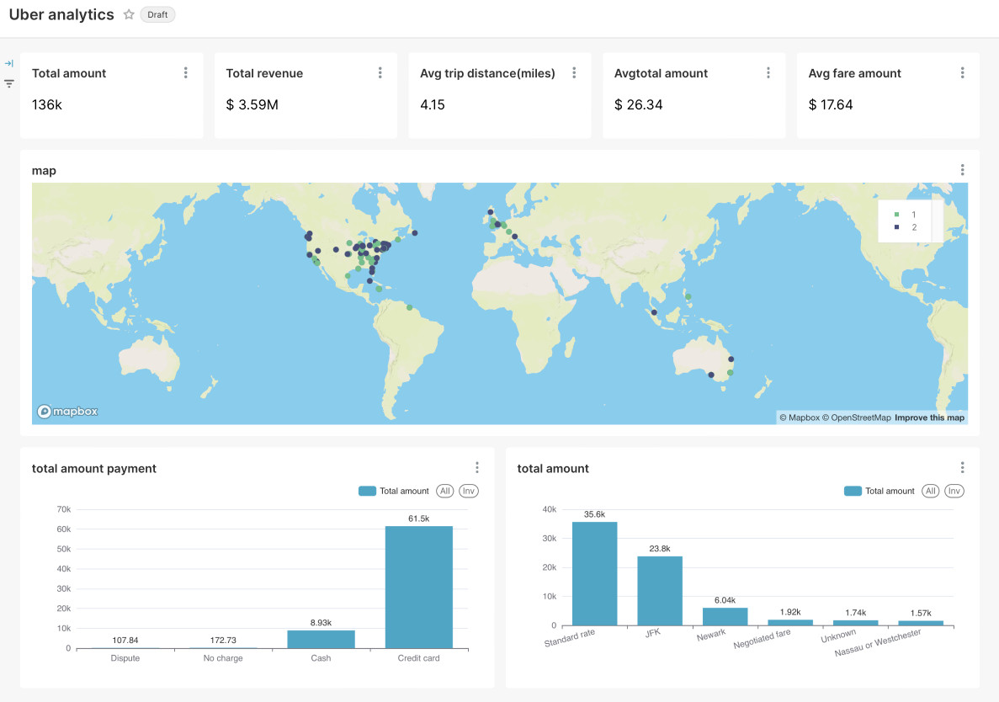

# Unlocking NYC Taxi Data Insights: Data Analysis with Spark, Delta Lake, PostgreSQL, Docker, and Apache Superset

In today's data-driven world, analyzing large datasets is crucial for gaining business insights. Our Taxi Data Analytics application utilizes `Spark`, `Delta Lake`, and `Superset` to transform raw taxi trip data into valuable intelligence

<p align="center">
  
</p>

## The Challenge: Data Integration Issues

Initially, our operations faced significant challenges with integrating diverse data sources. The disparate systems and formats made it difficult to compile and analyze trip data comprehensively.

This fragmentation resulted in incomplete insights and hindered our ability to make data-driven decisions effectively. Therefore, we needed a robust solution to unify our data sources or streamline the analysis process.

## Main Tasks:

### Objectives

- How many `total trips` were recorded, and what insights can be drawn from the trip volume?
- What is the `total revenue` generated, and what factors influence revenue trends?
- What is the `average trip distance`, and how does it vary by location?
- Where are `trips most concentrated geographically`, and how does this distribution identify high-demand areas?
- What is the `distribution of payment methods` (dispute, no charge, cash, credit card), and how do they impact revenue and customer satisfaction?
- What are the `total amounts` for each fare type (standard rate, JFK, Newark, negotiated fare, unknown, Nassau or Westchester), and how does fare type popularity influence overall revenue?

### Data Model:

<p align="center">
  
</p>

## Getting Started:

### Project file:

- [preparation_data.py](preparation_data.py):  is designed to merge and process raw data into a standardized format, ensuring high-quality data for analysis. Additionally, it stores the processed data in `Minio storage` for backup and processing purposes.

- [setup_coordinate_lookup.py](setup_coordinate_lookup.py): convert from `PulocationId` and `DolocationId` to exact coordinates with longitude and latitude.

- [setup_db_uber.py](setup_db_uber.py): is created to create database for storing as a `data warehouse` after processing.

- [sql_uber_analyst.sql](sql_uber_analyst.sql): for building `data warehouse` to execute visualization and analyst purpose. 

- [spark_analysts.py](spark_analysts.py): initializes the `Spark Session`, defines `configuration parameters`, process data and push them into data warehouse (PosgreSQL) and delta Lake.
 
## Running project:

0- Download [dataset](https://www.nyc.gov/site/tlc/about/tlc-trip-record-data.page) in `.parquet` format into `data` folder

1- Clone the repository:

```
git clone https://github.com/ntd284/analyze_NYC_taxi_insight.git
```

2- Navigate to the project directory:

```
cd analyze_NYC_taxi_insight
```

3- Install the needed packages and libraries:

```
pip3 install -r requirements.txt
```

4- Install Docker, Docker compose:

```
sudo ./installdocker.sh
docker --version
docker compose version
```

5- Download specific files in libs folder:

```
curl -o libs https://repo1.maven.org/maven2/com/amazonaws/aws-java-sdk-bundle/1.12.260/aws-java-sdk-bundle-1.12.260.jar
curl -o libs https://repo1.maven.org/maven2/org/apache/hadoop/hadoop-aws/3.3.4/hadoop-aws-3.3.4.jar
curl -o libs https://repo1.maven.org/maven2/org/postgresql/postgresql/42.2.20/postgresql-42.2.20.jar
```

6- Build docker:

```
docker compose up -d
```

7- Run step by step files:

```
python3 run setup_db_uber.py
python3 setup_coordinate_lookup.py
python3 run preparation_data.py
python3 spark_analysts.py
```

Check inserted table in <b>PostgreSQL</b> and <b>Minio</b> (`http://localhost:9001/`)
<p align="center">
  
</p>

8- Create Script in PostgreSQL to build visualization:

<p align="center">
  
</p>

9- Access to Superset in `http://localhost:8088/` to build visualization:

<p align="center">
  
</p>

### 🔑 Reference:
[1] [Uber Data Analytics | End-To-End Data Engineering Project](https://www.youtube.com/watch?v=WpQECq5Hx9g)

[2] [How to use MinIO with Spark](https://medium.com/@abdullahdurrani/working-with-minio-and-spark-8b4729daec6e)

[3] [NYC Taxi Trip Data Analysis](https://medium.com/@muhammadaris10/nyc-taxi-trip-data-analysis-45ecfdcb6f91)

<b> ⚡️⚡️That's all for my project, thanks for watching. If you have any question, don't hesitate inbox me. ⚡️⚡️</b>
